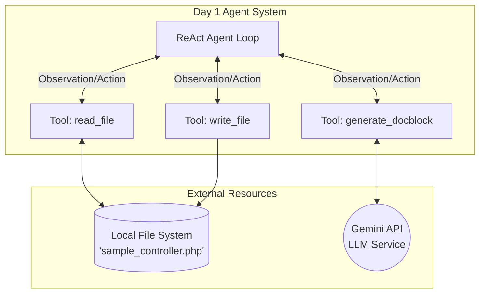
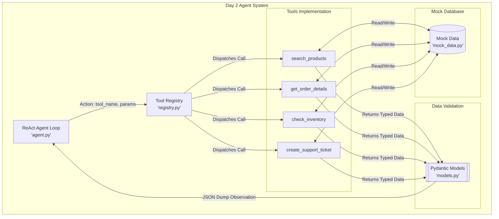

# Day 1 & Day 2 Agent Architecture Diagrams

## Day 1: Automated PHP Docblock Generator

```mermaid
architecture-beta
    group agent_system(Cloud)[Day 1 Agent System]
    
    service agent(server)[ReAct Agent Loop] in agent_system
    service tools(database)[Agent Tools] in agent_system
    
    service llm(cloud)[Gemini API]
    service filesystem(disk)[Local File System]
    
    agent:R --> L:tools
    
    tools:T --> B:llm
    tools:B --> T:filesystem
    
    %% Note: architecture-beta is newer, let's use standard graph TD for better compatibility
```

Let's use a standard `graph TD` for better rendering across tools.

### Day 1 Architecture

---

### Day 2 Architecture

