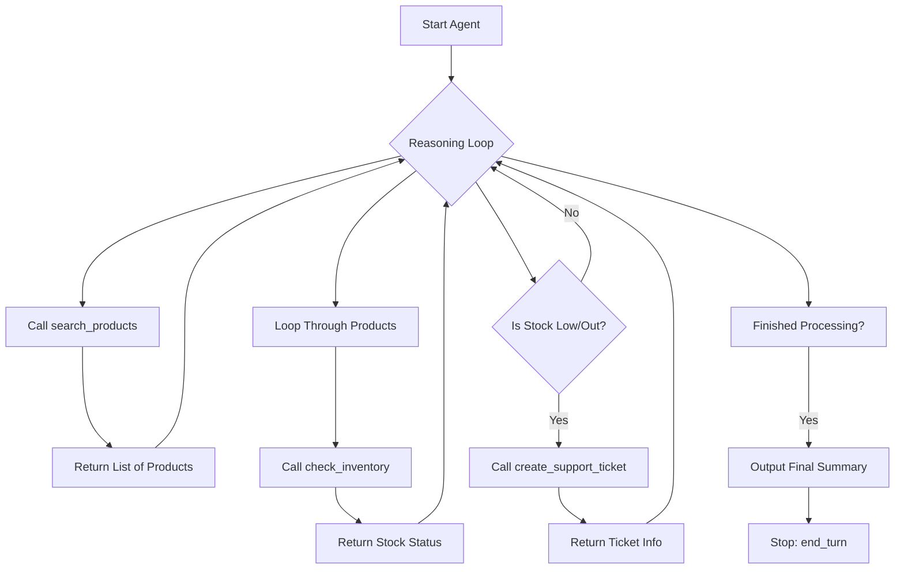

# Day 2 Project: Tool Registry Flow and Plan

## 1. Project Implementation Plan

The objective is to build a structured tool registry for an AI agent using Pydantic for type safety and mock data for simulation.

### Step-by-Step Breakdown:
1.  **Project Setup**: Initialize directory and files.
2.  **Pydantic Models**: Define schemas for all data exchange (Products, Orders, Inventory, Tickets).
3.  **Mock Data**: Set up static datasets.
4.  **Tool Development**: Implement tools with robust error handling (no exceptions).
5.  **Registry Creation**: Map tool names to implementation functions.
6.  **Agent Execution**: Implement the agent loop to solve the "Magento Inventory" scenario.

---

## 2. Agent Logic Flow Diagram

---

## 3. Tool Interaction Details

| Tool | Input | Output Model | Primary Logic |
| :--- | :--- | :--- | :--- |
| `search_products` | `query`, `limit` | `SearchResult` | String matching in mock PRODUCTS. |
| `get_order_details` | `order_id` | `Order` | Lookup in mock ORDERS. |
| `check_inventory` | `sku` | `InventoryStatus` | Lookup in INVENTORY + status logic (ok/low/out). |
| `create_support_ticket` | `customer_id`, `issue`, `priority` | `Ticket` | Generate ID + store (idempotent). |
