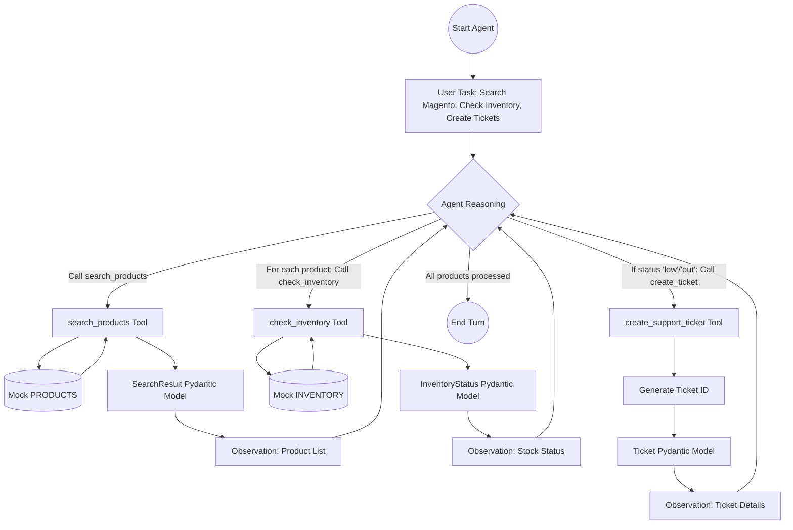

# Day 2: Tool Registry for Agents - Implementation Plan

The goal is to enhance the Day 1 agent by implementing a robust tool registry with strictly typed inputs and outputs using Pydantic. This ensures predictable tool behavior and better error handling within the agent's reasoning loop.

## Proposed Changes

### [Component 1] Project Structure Initialization
Set up the directory structure as specified in the task.

#### [NEW] [agent.py](file:///c:/SMIT%20CODEING/AI_AGENT_LEARNING/day2_agent/agent.py)
The main agent loop that uses the `TOOL_REGISTRY`.

#### [NEW] [tools/__init__.py](file:///c:/SMIT%20CODEING/AI_AGENT_LEARNING/day2_agent/tools/__init__.py)
Package initializer.

#### [NEW] [tools/models.py](file:///c:/SMIT%20CODEING/AI_AGENT_LEARNING/day2_agent/tools/models.py)
Pydantic models for all tool inputs and outputs.

#### [NEW] [tools/mock_data.py](file:///c:/SMIT%20CODEING/AI_AGENT_LEARNING/day2_agent/tools/mock_data.py)
Static data for products, orders, and inventory.

#### [NEW] [tools/search_products.py](file:///c:/SMIT%20CODEING/AI_AGENT_LEARNING/day2_agent/tools/search_products.py)
Implementation of the `search_products` tool.

#### [NEW] [tools/get_order_details.py](file:///c:/SMIT%20CODEING/AI_AGENT_LEARNING/day2_agent/tools/get_order_details.py)
Implementation of the `get_order_details` tool.

#### [NEW] [tools/check_inventory.py](file:///c:/SMIT%20CODEING/AI_AGENT_LEARNING/day2_agent/tools/check_inventory.py)
Implementation of the `check_inventory` tool.

#### [NEW] [tools/create_ticket.py](file:///c:/SMIT%20CODEING/AI_AGENT_LEARNING/day2_agent/tools/create_ticket.py)
Implementation of the `create_support_ticket` tool.

#### [NEW] [tools/registry.py](file:///c:/SMIT%20CODEING/AI_AGENT_LEARNING/day2_agent/tools/registry.py)
The `TOOL_REGISTRY` dictionary mapping names to functions.

---

### [Component 2] Data Modeling (Pydantic)
Define strict models in `tools/models.py` to ensure type safety.
- `ToolResult`: Base model for success/error tracking.
- `Product`, `Order`, `InventoryStatus`, `Ticket`: Data entities.

---

### [Component 3] Tool Implementation
Implement each tool as a discrete function that:
1. Accepts typed parameters.
2. Interacts with `mock_data.py`.
3. Returns a Pydantic model (never raw dicts).
4. Handles errors internally and returns `success=False` instead of raising exceptions.

---

### [Component 4] Agent Integration
- Implement the ReAct loop in `agent.py`.
- Ensure the agent can parse tool names and arguments.
- Use `TOOL_REGISTRY` to execute tools.
- Provide the specified scenario: Search Magento -> Check Inventory -> Create Ticket for low stock.

## Flow Diagram

## Verification Plan

### Automated Tests
- Run `agent.py` and verify the output sequence matches the expected 2 products -> 2 inventory checks -> 2 support tickets.
- Verify all tool outputs are Pydantic objects.

### Manual Verification
- Check terminal logs for typed models.
- Ensure `stop_reason` is `end_turn`.
